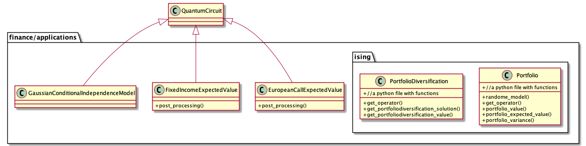
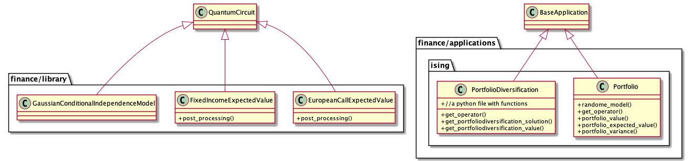
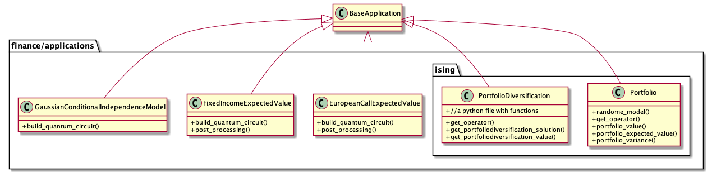

## Current class structure



- `EuropeanCallExpectedValue` `FixedIncomeExpectedValue` and `GaussianConditionalIndependenceModel` inherit `QuantumCircuit`.
  - They directly create a quantum circuit from problem information.
  - Then, those quantum circuit will be inputs to an amplitude estimation algorithm to solve the problem.
  - We need to discuss how to handle classes that inherit `QuantumCircuit` in new application libraries.

- `Portfolio.py` and `PortfolioDiversification.py` do not have classes and they have several functions related to each problem like old `Maxcut.py`.
  - We can easily re-design them to inherit `BaseApplication`

- In the [Qiskit finance tutorials](https://qiskit.org/documentation/tutorials/finance/index.html), some problems in the tutorials do not use specific classes for the problems and quantum circuits are directly created from the problem information. They are [Pricing European Put Options](https://qiskit.org/documentation/tutorials/finance/04_european_put_option_pricing.html#Pricing-European-Put-Options), [Pricing Bull Spreads](https://qiskit.org/documentation/tutorials/finance/05_bull_spread_pricing.html), [Pricing Basket Options](https://qiskit.org/documentation/tutorials/finance/06_basket_option_pricing.html), [Pricing Asian Barrier Spreads](https://qiskit.org/documentation/tutorials/finance/07_asian_barrier_spread_pricing.html), and [Option Pricing with qGANs](https://qiskit.org/documentation/tutorials/finance/10_qgan_option_pricing.html) (`EuropeanCallExpectedValue` is used in "Option Pricing with qGANs").
  - Do we want specific classes for these problems?


## New class structure
### Idea 1

- Keep `EuropeanCallExpectedValue` `FixedIncomeExpectedValue` and `GaussianConditionalIndependenceModel` as-is (inherit `QuantumCircuit`). Then, move them to a circuit library in the Qiskit finance.
- `Portfolio` and `PortfolioDiversification` inherit `BaseApplication`. Most of their functions can be replaced with functions in `BaseApplication` such as `interpret` and `evaluate`.

### Idea 2

- `EuropeanCallExpectedValue` `FixedIncomeExpectedValue` and `GaussianConditionalIndependenceModel` inherit `BaseApplication`.
  - Those classes have `to_quantum_circuit` instead of `to_quadratic_program`. Then, the output circuit will be used as an input of an amplitude estimation algorithm.
  - Do we keep original `EuropeanCallExpectedValue` `FixedIncomeExpectedValue` and `GaussianConditionalIndependenceModel` in a circuit library of the Qiskit finance or merge their functionality to `to_quantum_circuit()`?

- The same as the above for `Portfolio` and `PortfolioDiversification`.


### Use cases
- We can call `EuropeanCallExpectedValue.to_quantum_circuit()` to get a `QuantumCircuit` from the application class. The following is an example flow from creating a problem instance to getting the result.
```
european_call = EuropeanCallExpectedValue(num_uncertainty_qubits,
                                                strike_price,
                                                rescaling_factor=c_approx,
                                                bounds=(low, high), and so on)

european_call_circuit = european_call.to_quantum_circuit()

ae = IterativeAmplitudeEstimation(epsilon=epsilon, alpha=alpha,
                                  state_preparation=european_call_circuit,
                                  objective_qubits=[3],
                                  post_processing=european_call.post_processing)

result = ae.run(quantum_instance=Aer.get_backend('qasm_simulator'), shots=100)

european_call.interpret(result)
european_call.evaluate(result)
```