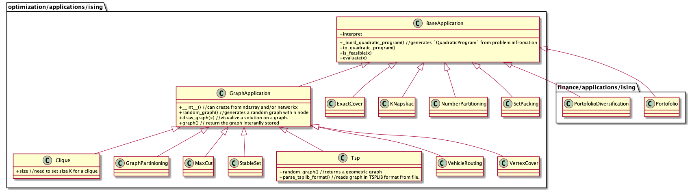

- A name for the most top class? (`OptimizationProblem`, `CombinatorialProblem`, or something)
- How handle an optimization model. `get_qp()` or `get_docplex()`?
- how to call a class which does not use graph (non "GraphProblem" class)
    - We can have SetProblem for non "GraphProblem" classes?
- Currently, each problem has their own function to return a solution e.g. `max_cut_value()`. We can have something like `get_solution()` to output the solution (The output format should depend on the problem e.g. True/False for a decision problem. Subsets for a set problem)?
- `get_graph_solution` in `GraphProblem` class is to visualize a graph based on a solution with networkx. For example, for maxcut, it paints each node in two colors.
- to_ising() //maybe we don't need this since we can convert a problem with converters

## Use cases
- We can call `OptimizationProblem.to_qp()` to get a `QuadraticProblem` from each problem class. For example, for max cut, it should be as follows.
```
# Prepare a max cut problem.
max_cut = MaxCut()

# Can generate a problem instance with a random graph
# Also, it can generate a problem instance with an adjacency matrix or a networkx graph
# e.g. max_cut = MaxCut(networkx_graph)
max_cut.random_graph()
qp = max_cut.to_qp()

# Solve the problem with QAOA
qaoa_mes = QAOA()
qaoa = MinimumEigenOptimizer(qaoa_mes)
qaoa_result = qaoa.solve(qp)

# Visualize a graph based on a solution with networkx and get the cut value for the solution.
max_cut.get_graph_solution(qaoa_result.x)
print(max_cut.max_cut_value(qaoa_result.x))
```